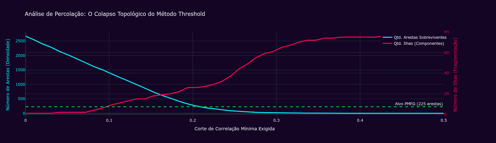
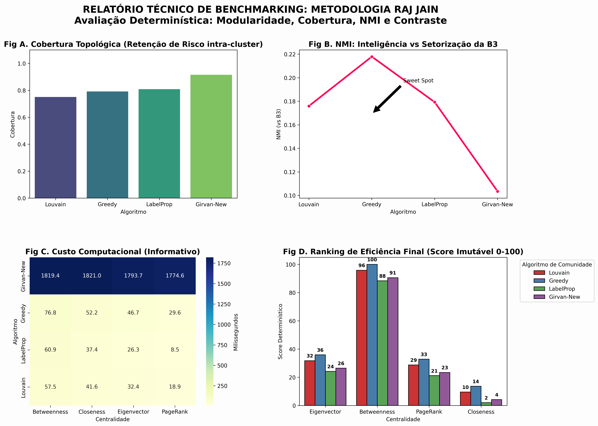
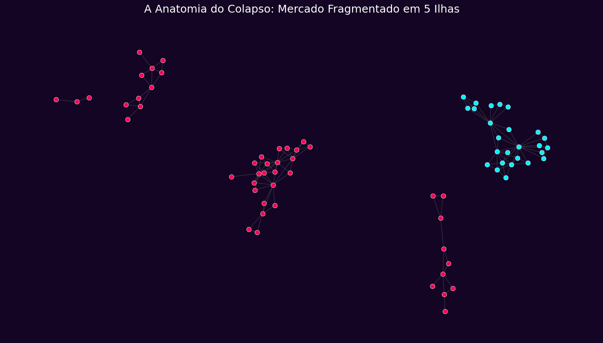

---

# 🌐 Análise de Risco Sistêmico e Contágio em FIIs (IFIX) via Teoria dos Grafos


[](https://fiis-graphs-moira-analytics-terminal.streamlit.app)

> **🔴 Demo Online:** Clique no selo "Streamlit" acima ou acesse o dashboard para interagir com a topologia do mercado em tempo real.

> **"Investir é um jogo de ligar os pontos. A parte boa é que, quanto mais tempo você passa no mercado e mais curioso intelectualmente você é, maior fica a sua coleção de dados e pontos para conectar." — Ted Weschler, gestor de investimentos da Berkshire Hathaway**

## 📖 Sobre o Projeto e a Pesquisa Científica

O **Moira Analytics** é um terminal de Data Science e Inteligência Artificial desenvolvido como a infraestrutura computacional para sustentar nossa pesquisa acadêmica sobre o comportamento sistêmico do IFIX. Mais do que um software, ele é a materialização de um rigoroso estudo sobre **Teoria das Redes Complexas e Econofísica** aplicado ao mercado de capitais brasileiro.

Batizamos de Moira Analytics porque acreditamos que a modelagem financeira precisa ser tratada como um sistema vivo e interconectado. O nome reflete a nossa metodologia: enquanto as Moiras tecem o destino, o nosso framework tece a topologia do mercado, permitindo enxergar as correlações ocultas que a análise fundamentalista tradicional não consegue captar. Além disso, criamos uma identidade de marca para facilitar a replicabilidade e o reconhecimento do nosso software como uma solução técnica autônoma.

### A Pesquisa (O Artigo Acadêmico)(paper/)
O núcleo deste trabalho é o nosso artigo de pesquisa, que investiga a transição de fase topológica do mercado de Fundos Imobiliários em diferentes ciclos macroeconômicos. Nosso estudo desafia a análise fundamentalista tradicional — que trata os ativos de forma isolada — ao demonstrar matematicamente que o IFIX funciona como um organismo interconectado, onde a "saúde" de um setor é, na verdade, uma função da estabilidade de toda a rede.

Nossa pesquisa aborda:

* **Benchmarking Algorítmico:** Desenvolvemos um estudo comparativo entre quatro motores de Inteligência Artificial (Louvain, Greedy, Label Propagation e Girvan-Newman) para identificar qual modelo melhor descreve a propagação de risco.

* **Topologia e Transição de Fase:** O artigo demonstra como o mercado passa de estados de "fluxo ordenado" para "colapso de ilhas" conforme a política monetária é alterada.

---

## 📉 A Dinâmica de Correlações no IFIX: Uma Abordagem via Teoria das Redes Complexas

A literatura de finanças quantitativas frequentemente aborda o risco sistêmico sob a ótica de correlações lineares estáticas, que falham em capturar as mudanças estruturais e as dependências ocultas entre ativos financeiros. Este trabalho propõe uma investigação sobre a topologia do mercado de Fundos de Investimento Imobiliário (IFIX) através de uma lente sistêmica e multidimensional.

O nosso estudo utiliza o **framework Moira Analytics** como motor computacional para validar as seguintes hipóteses acadêmicas:
* **Filtração Topológica:** A aplicação do algoritmo Planar Maximally Filtered Graph (PMFG) para isolar a estrutura fundamental de dependência do mercado, reduzindo o ruído estatístico inerente às correlações de Pearson e permitindo a visualização da espinha dorsal do sistema.
* **Inteligência Artificial de Aprendizado Não Supervisionado:** A utilização de algoritmos de detecção de comunidades para validar se a classificação setorial oficial (B3) reflete o comportamento real de risco dos ativos ou se existem "clusters de contágio" trans-setoriais latentes.
* **Dinâmica Temporal e Transições de Fase:** A análise da robustez estrutural do IFIX frente a ciclos macroeconômicos (períodos de aperto versus afrouxamento monetário), provando matematicamente que o mercado altera sua topologia em resposta direta à política monetária.
* **Métricas de Risco Sistêmico:** A aplicação de quatro centralidades distintas (Eigenvector, Betweenness, PageRank e Closeness) para identificar os nós críticos responsáveis pela propagação de choques e pela preservação da liquidez sistêmica.

---

## 🛠️ Tecnologias e Arquitetura Matemática

Este projeto orquestra algoritmos de ponta em ciência da computação e física estatística:

* **PMFG (*Planar Maximally Filtered Graph*):** Algoritmo de filtragem que preserva a integridade geométrica do mercado (planaridade), superior à tradicional Árvore Geradora Mínima (MST) por permitir ciclos de retroalimentação.
* **Centralidades (Risco):** Avaliação de *Eigenvector* (Efeito Dominó), *Betweenness* (Pontes de Liquidez), *PageRank* e *Closeness*.
* **Machine Learning (Clustering):** Algoritmos não-supervisionados de detecção de comunidades (*Greedy Modularity*, *Louvain*, *Label Propagation* e *Girvan-Newman*).
* **Metodologia Raj Jain:** *Cross-benchmarking* determinístico para validação do modelo, cruzando Modularidade, Cobertura (*Coverage*), NMI e Contraste de Risco.

---

## 📂 Estrutura do Repositório

```text
fiis_graphs/
├── docs/                            # Documentação técnica e científica do projeto
├── html/                            # Artefatos visuais e renderizações dinâmicas (PyVis)
│   ├── centralidades/               # Grafos interativos mapeando as 4 dimensões de risco
│   │   ├── pmfg_risco_betweenness.html
│   │   ├── pmfg_risco_closeness.html
│   │   ├── pmfg_risco_eigenvector.html
│   │   └── pmfg_risco_pagerank.html
│   ├── comunidades/                  # Grafos interativos mapeando as 4 metodologias de clustering
│   │   ├── pmfg_comunidade_girvan_newman.html
│   │   ├── pmfg_comunidade_greedy_modularity.html
│   │   ├── pmfg_comunidade_label_propagation.html
│   │   └── pmfg_comunidade_louvain.html
│   └── estresse/                    # Resultados do simulador de colapso (Targeted Attack)
│       └── pmfg_pos_colapso.html
├── img/                             # Imagens estáticas do artigo e gráficos de benchmarking
├── paper/                           # Contém o nosso artigo completo em PDF
├── src/
|   ├── data_processor.py            # Módulo de ingestão e ETL de dados históricos do IFIX  
|   └── network_model.py             # Módulo de construção e análise da rede topológica do mercado  
├── .gitignore                       # Arquivos ocultos (ignora o .venv311 e caches do VS Code)
├── app.py                           # Código-fonte principal do Terminal Web (Streamlit)
├── graphs.ipynb                     # Jupyter Notebook detalhado com a pesquisa matemática
├── LICENSE                          # Licença Creative Commons Atribuição-NãoComercial 4.0 Internacional (CC BY-NC 4.0)
├── README.md                        # Documentação oficial do projeto (este arquivo)
└── requirements.txt                 # Lista de dependências e motores (yfinance, networkx, etc.)
```

O ecossistema do projeto está dividido em duas frentes de operação:

### 1. [O Motor Científico (Jupyter Notebook)](graphs.ipynb)
O coração da pesquisa. Onde os dados brutos se transformam em geometria.
* **Ingestão e ETL:** Extração de séries temporais históricas com `yfinance` e conversão da correlação de Pearson em Distância Euclidiana.
* **Análise de Percolação:** Prova matemática do colapso topológico do método de Limiar (*Threshold*).
* **Benchmarking Determinístico:** O laboratório de testes da IA, elegendo a combinação **Greedy Modularity + Betweenness** como motor principal.
* **Teste de Estresse (*Targeted Attack*):** Simulação computacional deletando os 5 maiores Hubs do mercado para mapear a quebra do componente gigante e isolamento de órfãos.

### 2. [O Terminal Web Interativo (Streamlit App)](app.py)
A interface pronta para produção. Permite que investidores e pesquisadores interajam com o modelo de IA.
* Renderização 2D dinâmica da rede com `Plotly`.
* Ajuste em tempo real de sobrevivência de mercado e recorte temporal.
* Módulo de alocação de carteira (identificação de "Folhas" topológicas para *Hedge*).
* Documentação metodológica e científica embutida.

---

## 📊 Resultados Visuais e Descobertas

> **Nota:** As imagens estáticas abaixo são recortes do artigo. O terminal interativo possui renderização fluida no navegador.

### 1. Transição de Fase (Percolação vs PMFG)
A prova de que cortar correlações fracas arbitrariamente destrói a coesão do mercado. O PMFG preserva as 225 arestas vitais.
 

### 2. Benchmarking Algorítmico (Raj Jain)
A matriz de decisão matemática provando o "Sweet Spot" de inteligência do algoritmo *Greedy* ao encontrar o equilíbrio perfeito entre descoberta de novas correlações (NMI) e coesão interna.


### 3. O Colapso dos Super-Hubs (Stress Test)
O mercado financeiro após o *Targeted Attack*. O Grupo Ciano conseguiu manter rotas secundárias de liquidez, enquanto os pontos vermelhos sofreram congelamento isolado.
 

---

## 🚀 Como Executar o App (Ambiente Local)

Siga o passo a passo abaixo para iniciar o framework na sua máquina local.

**1. Clone o repositório:**
```bash
git clone https://github.com/seu-usuario/moira-analytics-ifix.git
cd moira-analytics-ifix
```

**2. Crie e ative um Ambiente Virtual (Recomendado)**

*Para usuários de Windows:*
```bash
python -m venv .venv
.\.venv\Scripts\activate
```
*Para usuários de Linux/Mac:*
```bash
python3 -m venv .venv
source .venv/bin/activate
```

**3. Instale as Dependências do Projeto**
```bash
pip install -r requirements.txt
```

**4. Execute o Dashboard no Terminal**
```bash
streamlit run app.py
```

**5. Encerre a Sessão**

Após fechar o navegador e parar o servidor no terminal (`Ctrl + C`), desative o ambiente virtual para retornar ao Python global do seu sistema:
```bash
deactivate
```

---

### 🎓 Equipe de Pesquisa

| Pesquisador(a) | Matrícula | Instituição |
| :--- | :---: | :---: |
| **Ana Paula Gomes Jacó** | 2025015633 | UNIFEI |
| **Bianca Salvador** | 2022012137 | UNIFEI |
| **Isaac Davi Mendonça Viana** | 2023000650 | UNIFEI |
| **Laura Raimundi Dias Jesus** | 2022002097 | UNIFEI |

---